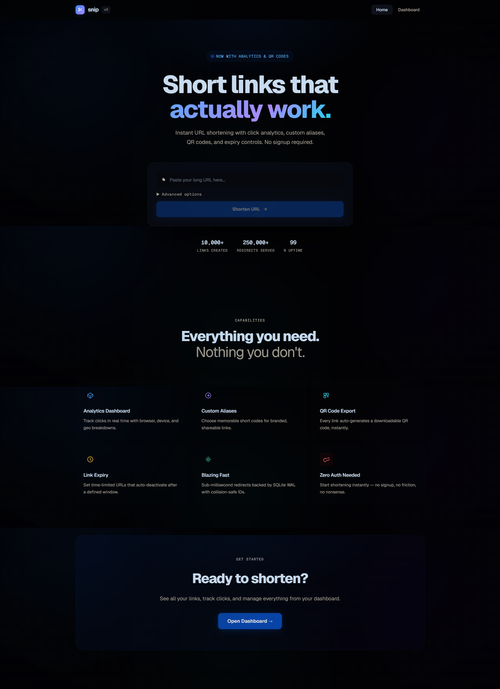
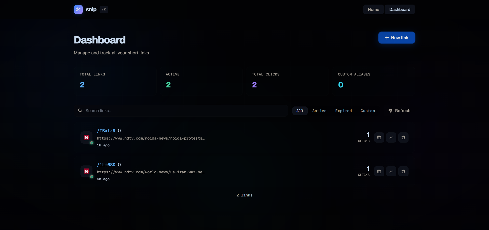

<div align="center">

<br />

```
  ✂  s n i p
```

# Snip — Short links that actually work.

**A production-grade URL shortener with real-time analytics, custom aliases, QR codes, and link expiry controls.**  
Built with Node.js, React, and SQLite. Zero signup required.

<br />

[](https://nodejs.org)
[](https://react.dev)
[](https://vitejs.dev)
[](https://sqlite.org)
[](LICENSE)
[]()

<br />

[**View Live Demo**](https://snip-short-links-that-work-5m8t.onrender.com) · [**GitHub Repo**](https://github.com/SamridhiiiGupta/SNIP-Short_links_that_work) · [**Report Bug**](https://github.com/SamridhiiiGupta/SNIP-Short_links_that_work/issues)

<br />

</div>

---

## 📸 Preview

<br />

**Landing Page**



> Clean hero section with an instant URL shortener form, animated gradient background, and feature grid.

<br />

**Dashboard**



> Full link management dashboard — search, filter, click tracking, and one-click analytics per link.

<br />

---

## ✨ Features

### Core
- ✂️ **Instant shortening** — Collision-resistant NanoID-based short codes generated in milliseconds
- 🔗 **Custom aliases** — Choose your own slug for branded, memorable links (`/my-launch`)
- ⏱️ **Link expiry** — Set links to auto-deactivate after N minutes
- 🗑️ **Link deletion** — Full CRUD management from the dashboard

### Analytics
- 📊 **Click tracking** — Every redirect is logged with browser, device type, and referrer
- 📈 **Daily click charts** — Area chart showing click trends over time (powered by Recharts)
- 🌍 **Geo insights** — Country detection on each redirect event
- 🥧 **Browser & device breakdown** — Pie chart + progress bars for device type distribution
- 🕐 **Recent events log** — Live feed of the last N clicks with timestamps

### Extras
- 📱 **QR code generation** — Auto-generated, downloadable QR code for every short link
- 📋 **One-click copy** — Instant clipboard copy with visual feedback
- 🔍 **Search & filter** — Filter links by status: All / Active / Expired / Custom
- 💀 **Skeleton loaders** — Smooth loading states on every async operation
- 🔔 **Toast notifications** — Animated slide-in toasts with success / error / info states
- 📐 **Fully responsive** — Works on mobile, tablet, and desktop

---

## 🛠️ Tech Stack

| Layer | Technology |
|-------|-----------|
| **Frontend** | React 18, Vite, React Router v6 |
| **Styling** | Pure CSS with custom design system (CSS variables, Geist font) |
| **Charts** | Recharts (AreaChart, PieChart) |
| **Backend** | Node.js, Express 5 |
| **Database** | SQLite via `better-sqlite3` (WAL mode for concurrent reads) |
| **ID Generation** | NanoID (collision-resistant 8-char IDs) |
| **QR Codes** | `qrcode` npm package |
| **Security** | Helmet.js, CORS, express-rate-limit |
| **Logging** | Morgan HTTP logger |
| **Dev tooling** | Nodemon, Concurrently |

---

## 🧠 How It Works

```
User pastes URL  →  POST /api/shorturls  →  NanoID generated  →  Saved to SQLite
                                                                         │
User visits /abc  →  GET /:code  →  Lookup in DB  →  Log analytics  →  302 Redirect
                                                                         │
Dashboard  →  GET /api/shorturls  →  List all links with click counts
           →  GET /api/shorturls/:code/stats  →  Full analytics breakdown
           →  GET /api/shorturls/:code/qr  →  Base64 QR code image
```

1. **Shortening** — A `POST` to `/api/shorturls` validates the URL, generates a NanoID (or uses your custom alias), stores it in SQLite, and returns the short link.
2. **Redirection** — Any `GET /:code` request looks up the code, logs the click event (browser, device, country, referrer), and immediately redirects with a `302`.
3. **Analytics** — The dashboard fetches per-link stats including daily aggregated clicks, browser/device breakdowns, and a raw event log.

---

## ⚙️ Installation & Setup

### Prerequisites
- Node.js `v18+`
- npm `v9+`

### 1. Clone the repo

```bash
git clone https://github.com/SamridhiiiGupta/SNIP-Short_links_that_work
cd snip
```

### 2. Install all dependencies (root + frontend)

```bash
npm run setup
```

> This runs `npm install` in the root and `cd frontend && npm install` automatically.

### 3. Configure environment

```bash
cp .env.example .env
```

Edit `.env`:

```env
PORT=3000
BASE_URL=http://localhost:3000
NODE_ENV=development
```

### 4. Start the development server

```bash
npm run dev
```

This starts **both** the backend (port `3000`) and the frontend (port `5173`) concurrently, and automatically opens the browser.

| Service | URL |
|---------|-----|
| Frontend | http://localhost:5173 |
| Backend API | http://localhost:3000/api |

---

## 🏗️ Project Structure

```
snip/
├── src/
│   ├── db/
│   │   └── connection.js       # SQLite connection + schema init
│   ├── middlewares/
│   │   └── logger.js           # Morgan HTTP logger
│   ├── routes/
│   │   └── shorturls.js        # All /api/shorturls routes
│   └── index.js                # Express app entry point
│
├── frontend/
│   ├── src/
│   │   ├── components/
│   │   │   ├── Navbar.jsx
│   │   │   ├── ShortenerForm.jsx
│   │   │   ├── StatsModal.jsx
│   │   │   └── Toast.jsx
│   │   ├── hooks/
│   │   │   └── useToast.js
│   │   ├── lib/
│   │   │   └── api.js          # Typed API client
│   │   ├── pages/
│   │   │   ├── Home.jsx
│   │   │   └── Dashboard.jsx
│   │   ├── App.jsx
│   │   ├── main.jsx
│   │   └── index.css           # Full design system
│   ├── index.html
│   └── vite.config.js
│
├── db.sqlite                   # Auto-created on first run
├── Dockerfile
├── nginx.conf.example
└── package.json
```

---

## 🚀 Deployment

### Docker (Recommended)

```bash
docker build -t snip .
docker run -p 3000:3000 -v $(pwd)/data:/app/data snip
```

### Manual (VPS / Cloud VM)

```bash
# Build frontend
npm run build:frontend

# Start production server
NODE_ENV=production npm start
```

Then point Nginx to port `3000` using the included `nginx.conf.example`.

### Vercel + Railway

| Service | Platform |
|---------|---------|
| Frontend | [Vercel](https://vercel.com) — connect `/frontend` as root |
| Backend + DB | [Railway](https://railway.app) — attach a persistent volume for SQLite |

> **Tip:** For high-traffic production use, consider replacing SQLite with PostgreSQL and using a managed database like Supabase or Neon.

---

## 📊 API Reference

| Method | Endpoint | Description |
|--------|----------|-------------|
| `POST` | `/api/shorturls` | Create a short link |
| `GET` | `/api/shorturls` | List all short links |
| `GET` | `/api/shorturls/:code/stats` | Get analytics for a link |
| `GET` | `/api/shorturls/:code/qr` | Get QR code (base64 PNG) |
| `DELETE` | `/api/shorturls/:code` | Delete a link |
| `GET` | `/:code` | Redirect to original URL |
| `GET` | `/health` | Health check |

**Create short link — request body:**
```json
{
  "url": "https://example.com/very/long/path",
  "shortcode": "my-link",
  "validity": 1440,
  "title": "My link label"
}
```

---

## 🔮 Roadmap

- [ ] **Authentication** — User accounts with private link collections
- [ ] **Link passwords** — Password-protect any short link
- [ ] **Bulk import** — CSV upload to shorten many URLs at once
- [ ] **Click maps** — Visual geo heatmap of click origins
- [ ] **API keys** — Programmatic access for developers
- [ ] **Teams** — Shared workspaces and link collaboration
- [ ] **Custom domains** — Use your own domain for short links
- [ ] **PostgreSQL support** — For larger deployments beyond SQLite

---

## 🤝 Contributing

Contributions are welcome! Here's how to get started:

```bash
# Fork the repo, then:
git clone https://github.com/SamridhiiiGupta/SNIP-Short_links_that_work
git checkout -b feature/your-feature-name

# Make your changes, then:
git commit -m "feat: add your feature"
git push origin feature/your-feature-name
# Open a Pull Request
```

Please follow the existing code style and include a clear PR description.

---

## 📄 License

MIT License — see [LICENSE](LICENSE) for details.

---

<div align="center">

Built with ☕ and care.  
If you found this useful, consider giving it a ⭐ on GitHub.

</div>
