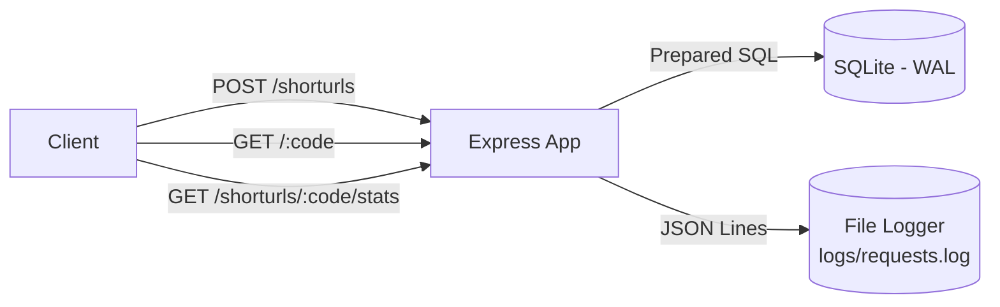
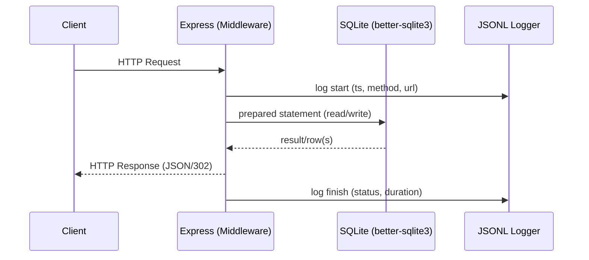
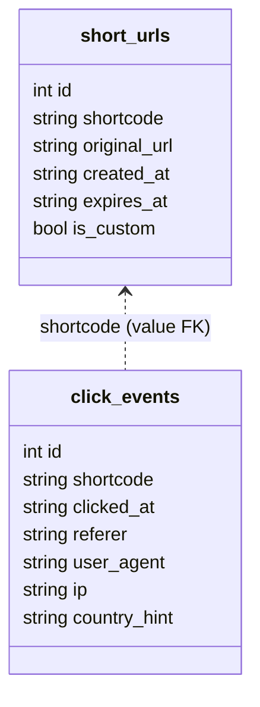

# System Design (Interactive)

> A lightweight, dependable, and observable URL shortener service designed for clarity and easy evolution.

## 1) Architecture Overview

- HTTP API (Express) with middleware pipeline: helmet, CORS, JSON body parser, custom JSONL logger.
- Stateless application; all state in the database; logs as append-only JSONL.
- SQLite (better-sqlite3) with Write-Ahead Logging (WAL) for safe concurrency in a single-node setup.
- Liveness via `/health`.

<b>Request Lifecycle (sequence)</b>

## 2) Data Model

| Table | Columns |
|------|---------|
| `short_urls` | `id` PK, `shortcode` UNIQUE, `original_url`, `created_at`, `expires_at` (nullable), `is_custom` (bool) |
| `click_events` | `id` PK, `shortcode`, `clicked_at`, `referer` (nullable), `user_agent` (nullable), `ip` (nullable), `country_hint` (nullable) |

Rationale: normalized write model with value-FK keeps queries simple; future rollups/materialized views can accelerate reporting.

## 3) Key Decisions & Justifications

- SQLite + better-sqlite3: zero-ops, great local/dev experience, WAL handles concurrent access in single-node deployments.
- Nanoid (ESM via dynamic import): tiny, low-collision IDs; dynamic import preserves CommonJS runtime.
- JSONL logging: append-only, grep/ELK/Loki-friendly, easy to ship.
- DB-enforced uniqueness: prevents race conditions on shortcode allocation.
- Small explicit SQL (prepared statements): performance and safety.

## 4) API Surface

- POST `/shorturls` → create short link (optional custom code, validity in minutes)
- GET `/:code` → 302 redirect to original URL (404 not found, 410 expired)
- GET `/shorturls/:code/stats` → totals + recent events

<b>Error Semantics</b>

| Status | When |
|-------:|------|
| 400 | Invalid URL or shortcode format |
| 404 | Shortcode not found |
| 409 | Custom shortcode already exists |
| 410 | Shortcode exists but is expired |

## 5) Security & Resilience

- Validation at boundaries (URL, shortcode regex), JSON body size limits.
- helmet for hardened defaults; CORS for controlled cross-origin access.
- Central error handler; no stack traces leaked to clients.
- Expiry enforced at read-time; expired links never redirect.

## 6) Observability

- Request logs: ts, id, method, url, status, latency, ip, user-agent (JSONL to `logs/requests.log`).
- Click events: audit trail for analytics and debugging.
- `/health` endpoint for liveness probes.

## 7) Scalability & Evolution

- Vertical scale first; WAL supports moderate concurrency.
- Horizontal path: migrate to Postgres (same constraints), add caching (in-memory/Redis) for hot shortcodes, CDN/edge redirects for lowest latency.
- Periodic rollups/materialized views for reporting at scale.

## 8) Maintainability

- Clear module boundaries: routes, middleware, db connection.
- Minimal dependencies; explicit schema bootstrap.
- Deterministic behavior and scripted verification.

## 9) Assumptions

- Single-region, single-instance acceptable initially; consistency favored.
- Validity defined in minutes from creation time; no mid-life extension.
- IP stored as a coarse hint only (no PII enrichment).

## 10) Future Enhancements

- Rate-limiting and API keys; per-tenant namespaces.
- OpenAPI/Swagger docs; minimal web UI.
- Geo enrichment via edge headers/MaxMind.
- Dockerfile + one-click deploy; CI/CD with health checks and log shipping.
