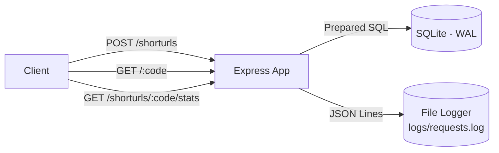
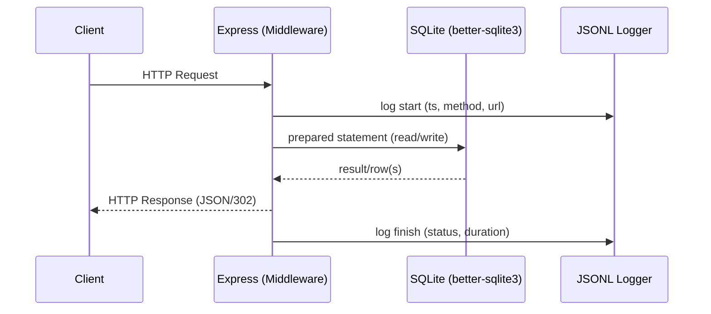
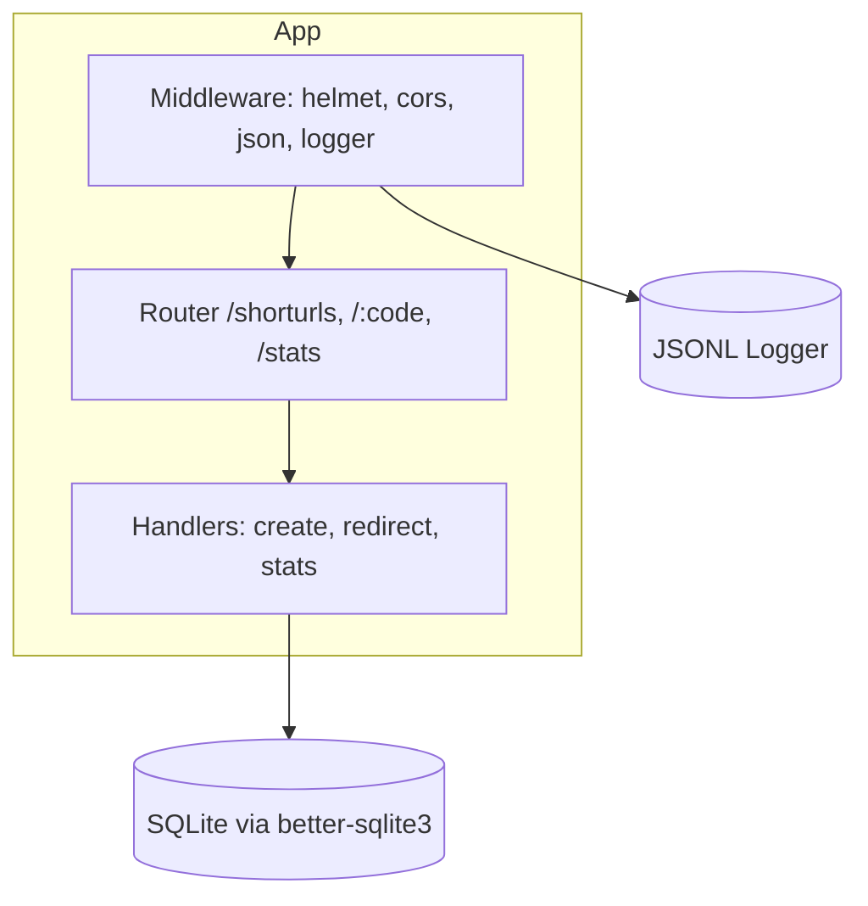
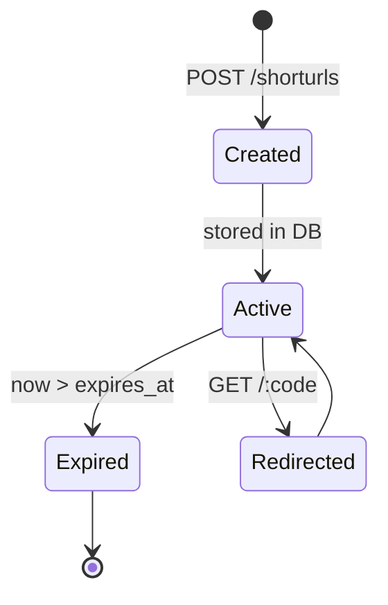
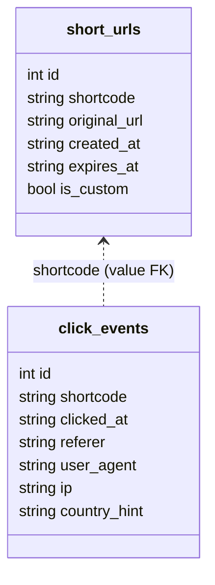
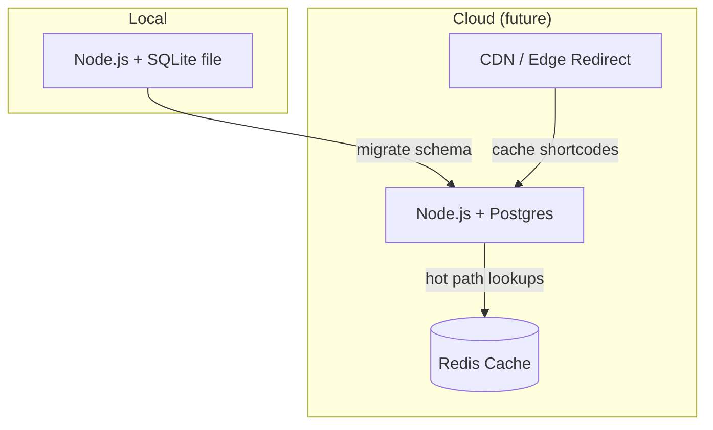

# System Design

<p align="center">
  
  
  
</p>

### Quick Nav
- [Architecture Overview](#1-architecture-overview)
- [Data Model](#2-data-model)
- [Key Decisions](#3-key-decisions--justifications)
- [API Surface](#4-api-surface)
- [Security & Resilience](#5-security--resilience)
- [Observability](#6-observability)
- [Scalability & Evolution](#7-scalability--evolution)
- [Maintainability](#8-maintainability)
- [Assumptions](#9-assumptions)
- [Future Enhancements](#10-future-enhancements)
- [Deployment Options](#11-deployment-options)
- [NFRs](#12-non-functional-requirements-checklist)
- [Risks & Mitigations](#13-risks--mitigations)
- [Glossary](#14-glossary)

> Tip: Click the collapsible sections for deeper dives and alternative views.

> A lightweight, dependable, and observable URL shortener service designed for clarity and easy evolution.

## 1) Architecture Overview

- HTTP API (Express) with middleware pipeline: helmet, CORS, JSON body parser, custom JSONL logger.
- Stateless application; all state in the database; logs as append-only JSONL.
- SQLite (better-sqlite3) with Write-Ahead Logging (WAL) for safe concurrency in a single-node setup.
- Liveness via `/health`.



<details>
<summary><b>Request Lifecycle (sequence)</b></summary>



</details>

<details>
<summary><b>Components (static view)</b></summary>



</details>

<details>
<summary><b>Shortcode lifecycle (state diagram)</b></summary>



</details>

## 2) Data Model

| Table | Columns |
|------|---------|
| `short_urls` | `id` PK, `shortcode` UNIQUE, `original_url`, `created_at`, `expires_at` (nullable), `is_custom` (bool) |
| `click_events` | `id` PK, `shortcode`, `clicked_at`, `referer` (nullable), `user_agent` (nullable), `ip` (nullable), `country_hint` (nullable) |



Rationale: normalized write model with value-FK keeps queries simple; future rollups/materialized views can accelerate reporting.

<details>
<summary><b>Entity responsibilities</b></summary>

| Entity | Responsibility |
|---|---|
| short_urls | Single source of truth for mapping; enforces uniqueness and expiry semantics |
| click_events | Immutable audit of access patterns for analytics and debugging |

</details>

## 3) Key Decisions & Justifications

- SQLite + better-sqlite3: zero-ops, great local/dev experience, WAL handles concurrent access in single-node deployments.
- Nanoid (ESM via dynamic import): tiny, low-collision IDs; dynamic import preserves CommonJS runtime.
- JSONL logging: append-only, grep/ELK/Loki-friendly, easy to ship.
- DB-enforced uniqueness: prevents race conditions on shortcode allocation.
- Small explicit SQL (prepared statements): performance and safety.

## 4) API Surface

- POST `/shorturls` → create short link (optional custom code, validity in minutes)
- GET `/:code` → 302 redirect to original URL (404 not found, 410 expired)
- GET `/shorturls/:code/stats` → totals + recent events

<details>
<summary><b>Error Semantics</b></summary>

| Status | When |
|-------:|------|
| 400 | Invalid URL or shortcode format |
| 404 | Shortcode not found |
| 409 | Custom shortcode already exists |
| 410 | Shortcode exists but is expired |

</details>

<details>
<summary><b>Example payloads</b></summary>

```json
// Create
{ "url": "https://example.com", "validity": 60, "shortcode": "afford2025" }

// Stats response (shape)
{
  "shortcode": "afford2025",
  "originalUrl": "https://example.com",
  "createdAt": "2025-01-01T00:00:00Z",
  "expiry": "2025-01-01T01:00:00Z",
  "clicks": 12,
  "recent": [ { "clicked_at": "...", "referer": "..." } ]
}
```

</details>

## 5) Security & Resilience

- Validation at boundaries (URL, shortcode regex), JSON body size limits.
- helmet for hardened defaults; CORS for controlled cross-origin access.
- Central error handler; no stack traces leaked to clients.
- Expiry enforced at read-time; expired links never redirect.

## 6) Observability

- Request logs: ts, id, method, url, status, latency, ip, user-agent (JSONL to `logs/requests.log`).
- Click events: audit trail for analytics and debugging.
- `/health` endpoint for liveness probes.

## 7) Scalability & Evolution

- Vertical scale first; WAL supports moderate concurrency.
- Horizontal path: migrate to Postgres (same constraints), add caching (in-memory/Redis) for hot shortcodes, CDN/edge redirects for lowest latency.
- Periodic rollups/materialized views for reporting at scale.

<details>
<summary><b>Performance targets (initial)</b></summary>

| KPI | Target |
|---|---|
| p95 create latency | < 100 ms |
| p95 redirect latency | < 20 ms (in-memory DB read) |
| p95 stats latency | < 120 ms |
| 1-day data retention | Unlimited (local dev); rotate logs as needed |

</details>

## 8) Maintainability

- Clear module boundaries: routes, middleware, db connection.
- Minimal dependencies; explicit schema bootstrap.
- Deterministic behavior and scripted verification.

## 9) Assumptions

- Single-region, single-instance acceptable initially; consistency favored.
- Validity defined in minutes from creation time; no mid-life extension.
- IP stored as a coarse hint only (no PII enrichment).

## 10) Future Enhancements

- Rate-limiting and API keys; per-tenant namespaces.
- OpenAPI/Swagger docs; minimal web UI.
- Geo enrichment via edge headers/MaxMind.
- Dockerfile + one-click deploy; CI/CD with health checks and log shipping.

---

<details>
<summary><b>Deployment checklist</b></summary>

- [ ] Create .env with PORT and any CORS settings
- [ ] Build container image (future)
- [ ] Configure health checks (/health)
- [ ] Log shipping to ELK/Loki (future)
- [ ] Set up backups/retention for DB (or managed Postgres)

</details>

## 11) Deployment Options



<details>
<summary><b>Trade-offs: SQLite vs Postgres (decision matrix)</b></summary>

| Criterion | SQLite (current) | Postgres (future) |
|---|---|---|
| Ops | Zero-ops | Managed service
| Concurrency | Good with WAL (single node) | Horizontal scale
| Latency | Very low | Low (network hop)
| Migrations | Simple | Strong tooling
| Cost | Minimal | Varies by plan

</details>

## 12) Non-Functional Requirements (Checklist)

- [x] Availability adequate for single-instance dev setup
- [x] Data consistency on shortcode uniqueness
- [x] Observability via JSONL and stats endpoint
- [x] Security headers and input validation
- [ ] Rate limiting (planned)
- [ ] Auth/API keys (planned)

## 13) Risks & Mitigations

- Collisions on random codes → DB UNIQUE constraint + retry
- Log file growth → rotate/ship logs (future)
- Hot key lookups → add in-memory/Redis cache (future)
- Single-node limits → migrate to Postgres and scale out (future)

## 14) Glossary

- Shortcode: unique token mapping to original URL
- JSONL: JSON Lines; one JSON object per line
- WAL: Write-Ahead Logging, improves concurrency in SQLite
